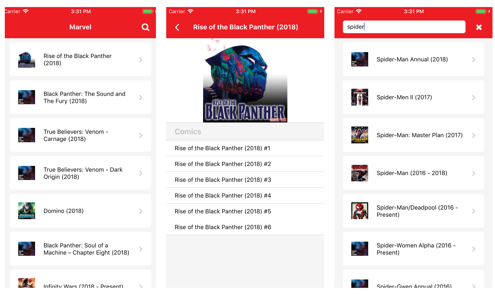

# Marvel App

Learning [React Native](https://facebook.github.io/react-native/), using [Marvel API](https://developer.marvel.com/).



## Prerequisites

- [NodeJs](https://nodejs.org/en/)
- [React Native](https://facebook.github.io/react-native/docs/getting-started.html)

## Install

- Open Terminal
- Clone this repository
- Go to the project folder
- Install dependencies

```
git clone https://github.com/adrianomarquess/marvel-example.git
cd marvel-example
npm install
```

## Usage

Run app

`react-native start`

`react-native run-ios` or `react-native run-android`
